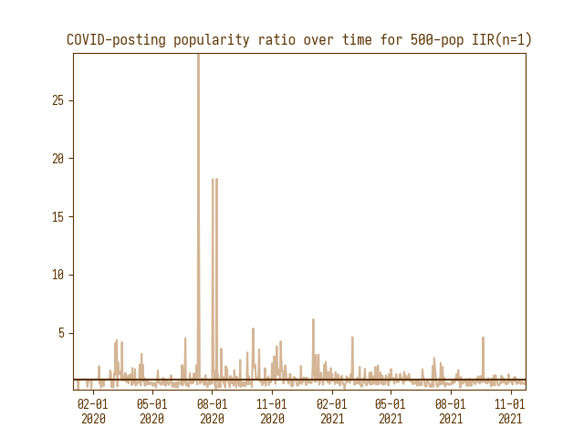
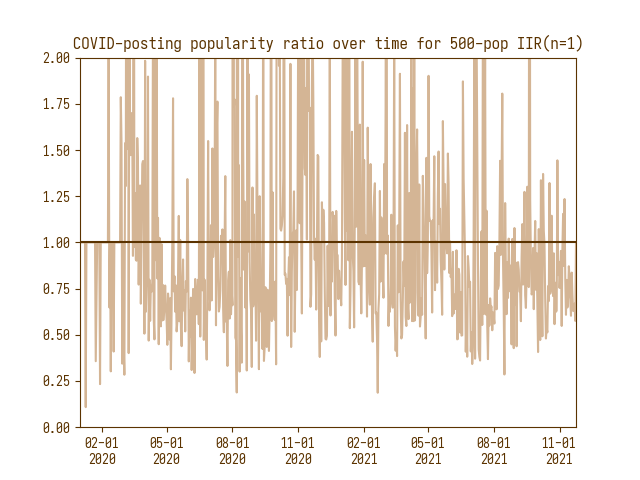

# Meta Analysis

This section aims at gaining some insights about the differences in our samples and the scode that the results might apply or generalize to. This section also answers the first part of our research question: **how frequently does people post about COVID-related issues, and how interested are people to see COVID-related posts?**

## Demographics

Our data come from three samples:
* `500-pop`: The list of 500 most followed users on Twitter.
* `500-rand`: A sample of 500 random users on Twitter who speaks English, Chinese, or Japanese with at least 1000 posts and at least 150 followers.
* `eng-news`: [Top 100 most influential news Twitter accounts by Nur Bremmen](https://memeburn.com/2010/09/the-100-most-influential-news-media-twitter-accounts/), combined with all news accounts which TwitterNews reposted.

## COVID-19 Posting Frequency

First, we analyzed how frequently the users in these three datasets are posing about COVID-19 (ignoring retweets). Initially, we were expecting that most people will post about COVID-19 because this pandemic is very relevant to every one of us. However, we found that there are many people in our samples didn't post about COVID-19 at all. The following table shows how many people in each sample didn't post or posted less than 1% about COVID-19:

@include `/freq/didnt-post.md`

The `eng-news` sample has the lowest number of users who didn't have COVID-related posts, the `500-rand` sample has the highest, while `500-pop` sits in between. This large difference between `eng-news` and the rest can be explained by the news channels' obligation to report news, which includes news about new outbreaks, progress of vaccination, new cross-border policies, etc. Also, we observed that `500-pop` has much more users who posted COVID-related content than `500-rand`, while they have similar amounts of users posting less than 1%. This finding might be explained by how influential people have more incentive to express their support toward slowing the spread of the pandemic than regular users, which doesn't require frequent posting like news channels.

We calculated frequency by dividing the total number of tweets by the number of COVID-related tweets. We might graph the frequencies on a histogram to gain more insight: (You can click on the images to enlarge them, and hold down E to view full screen).

    

    

    

However, as you can see, the graphs are not very helpful because the majority of the sample post below 0.1%, and there are many outliers who post very frequently, like 40%. For example, if we sort the samples by their frequency, we have a few outliers who post more than 20% even in `500-rand`:

@include-cut `/freq/500-rand-top-20.md` 0 10

So, we removed the outliers using the method proposed by Boris Iglewicz and David Hoaglin (1993) [[1]](#ref1) and ignoring everyone who posted below 0.1% and graphed the same histogram again:

    

    

    

As expected, the distributions looks right-skewed, with most people posting not very much. One interesting distinction is that, even though the distributions follow similar shapes, the x-axis ticks of `eng-news` is actually ten times larger than the other two, which means that `eng-news` post a lot more about COVID-19 on average than the other two samples. We can calculate some statistics of the samples to further verify this:

@include-lines `/freq/stats.md` 0 1 4 5

Since there are many outliers, medians and IQR will more accurately represent the center and spread of this distribution. As these numbers show, `eng-news` do post much more (6.1% more post3, or a 1220% increase) than the other two samples. Again, this can be explained by the news channels' obligation to report news related to COVID-19 or to promote methods to slow the spread of the pandemic.

## COVID-19 Popularity Ratios

Then, we analyzed the popularity ratio of COVID-related posts for our three samples. The popularity of a post defines how much other people are interested in the post, measured by the total number of user interactions (likes and comments) on that post. From that data, the relative popularity ratio for COVID-related posts calculates how popular are COVID-related posts compared to all other posts, calculated by the equation, which is a ratio of the average popularity of both:

<blockquote>
$$ pop_{user} = \left(\frac{\sum\text{Popularity of COVID-posts}}{|\text{COVID-posts}|}\right) / \left(\frac{\sum \text{Popularity of all posts}}{|\text{All posts}|}\right)$$
</blockquote>

There are three divisions in this equation, so there are three possible places where it might divide by zero. So, to prevent division by zero, we ignored people who didn't post about COVID-19 or didn't post anything at all, and we also ignored people who have literally 0 popularity on any of their posts. In our data, we ignored this amount of people for each sample:

@include `/pop/ignored.md`

Graphing the results, we find that the ***TODO***

    

    

    

@include-lines `/pop/stats.md` 0 1 2 3 4 5

# Change Analysis

After we answered how frequently people posted about COVID-19 and how interested are people to view these posts, we analyze our data over the posting dates to answer the second part of our research question: **How does posting frequency and people's interests in COVID-19 posts changes from the beginning of the pandemic to now?**

## Method

This analysis is separate for each of our samples, just like the previous analysis. However, unlike how tweets are separated for each user in the previous analysis, we combine the tweets of all users in each sample in this analysis. In this analysis, we defined the start of COVID-19 as _2020-01-01_ and ignored all posts prior to this date. Then, we calculate the average frequency and popularity ratio for every day since _2020-01-01_. This calculation gave us a list `freqs` and a list `pops` where, for every date `dates[i]`,

<blockquote>
$$ \text{freqs}_i = \frac{|\text{COVID-posts on date}_{i}|}{|\text{All posts on date}_{i}|} $$
</blockquote>

<blockquote>
$$ \text{pops}_i = \frac{ \sum_{u \in \text{Users}} \left(\frac{\sum\text{Popularity of u's COVID-posts on date}_i}{(\text{Average popularity of all u's posts}) \cdot |\text{u's COVID-posts on date}_i|}\right)}{(\text{Number of users posted on date}_i)} $$
</blockquote>

After calculation, we decided to plot line charts of `freqs` or `pops` against `dates`. Initially, we are seeing graphs with very high peaks such as the graph below. After some investigation, we found that these peaks are caused by not having enough tweets on each day to average out the random error of one single popular tweet. For example, in the graph below, we adjusted the program to print different users' popularity ratios when we found an average popularity ratio of greater than 20, which produced the output on the right. As it turns out, on 2020-07-11, the user @juniorbachchan posted that he and his father tested positive, and that single post is 163.84 times more popular than the average of all his posts. (The post is linked [here](https://twitter.com/juniorbachchan/status/1282018653215395840), it has 235k likes, 25k comments, and 32k retweets). Even though these data points are outliers, there isn't an effective way of removing them since we don't have enough tweets data from each user to calculate their range (for example, someone's COVID-related post might be the only one they've posted). So, we've decided to limit the viewing window to `y = [0, 2]` as shown in the graph on the right.

    

    
<pre>
Date:  2020-07-11
- JoeBiden 1.36
- juniorbachchan 163.84
- victoriabeckham 0.80
- anandmahindra 7.66
- gucci 0.13
- StephenKing 0.61
    </pre>

    

Then, we encountered the issue of noise. When we plot the graph without a filter, we found that the graph is actually very noisy. We decided to average the results over 7 days. Then, we also experimented with different filters from the `scipy` library and different parameter values, and chose to use an IIR filter with `n = 10`.

    

    

    

## Results - Posting Frequency

We graphed the posting frequencies of our three samples in line graphs with the x-axis being the date, which gave us the following graphs:

    

    

    

For all three samples, the posting rates were almost zero during the first month when COVID-19 first started, which is expected because no one knew how devastating it will be at that time. Then, all three samples had a peak in posting frequencies from 

For `500-rand` and `eng-nes`, 

**_TODO_**

## References

[1] Iglewicz, Boris, & David Hoaglin (1993), "Volume 16: How to Detect and
Handle Outliers", _The ASQC Basic References in Quality Control:
Statistical Techniques_, Edward F. Mykytka, Ph.D., Editor.

